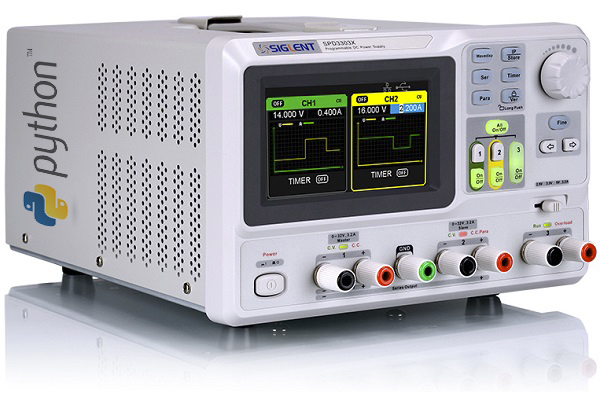

Brief
=====
This code was created to make programmable power supply usable in automation tasks. Siglent provides native software, but it has lot of dependencies and is cumbersome to use. Also python code allows to control instrument from single board computers like Raspberry Pi!

[Manufacturer link](https://www.siglent.eu/siglent-spd3303x-power-supply.html)




siglent_psu_api.py
==================
This is main api file to interact with siglent power supply instrument. Tested with **SPD3303X**. It provides simple pythonistic way to operate instrument remotely and automate some measurements.

Issues
======
Despite the fact that siglent manufactures affordable instruments, there are some issues. Can't speak of other power supplies but SPD3303X has flaws listed below:
* It beeps everytime command is received. It is impossible to switch this feature off.
* Can't read CH3 output status with documented commands
* Can't set operatio mode (PARALLEL/SERIAL/INDEPNDEND) from provided commands

example.py
==========
This code demonstrates simplicity of use. 

```
import siglent_psu_api as siglent

s = siglent.SIGLENT_PSU("192.168.0.22")

# read instrument identification string
i = s.identify()
print(i)

# read instrument status
sys = s.system()
print(sys)

# switch on CH1
s.output(siglent.CHANNEL.CH1, siglent.STATE.ON)

# set CH1 voltage to 2V
s.set(siglent.CHANNEL.CH1, siglent.PARAMETER.VOLTAGE, 2.0)

# read voltage
r = s.measure(ch = siglent.CHANNEL.CH1, parameter = siglent.PARAMETER.VOLTAGE)
print(r)

```

Results
```
{'manufacturer': 'Siglent Technologies', 'model': 'SPD3303X', 'sn': 'SPD3XHBX2R****', 'firmware_ver': '1.01.01.02.05', 'hadrware_ver': 'V3.0'}
{'ch1_mode': <MODE.CC: 2>, 'ch2_mode': <MODE.CC: 2>, 'mode': <TRACK.INDEPENDENT: 0>, 'ch1': <STATE.ON: 1>, 'ch2': <STATE.OFF: 0>}
2.001
```


sweep.py
========
```
import siglent_psu_api as siglent
import numpy as np

s = siglent.SIGLENT_PSU("192.168.0.22")

# read instrument identification string
i = s.identify()
print(i)

# read instrument status
sys = s.system()
print(sys)

# switch on CH1
s.output(siglent.CHANNEL.CH1, siglent.STATE.ON)

# sweep specified range
range_min = 1
range_max = 5
range_step = 0.1
ra = np.arange(range_min, range_max, range_step)
for i in ra:
    s.set(siglent.CHANNEL.CH1, siglent.PARAMETER.VOLTAGE, i)
    r = s.measure(ch = siglent.CHANNEL.CH1, parameter = siglent.PARAMETER.POWER)
    print(r)

```

Results

```
{'manufacturer': 'Siglent Technologies', 'model': 'SPD3303X', 'sn': 'SPD3XHBX2R****', 'firmware_ver': '1.01.01.02.05', 'hadrware_ver': 'V3.0'}
{'ch1_mode': <MODE.CC: 2>, 'ch2_mode': <MODE.CC: 2>, 'mode': <TRACK.INDEPENDENT: 0>, 'ch1': <STATE.ON: 1>, 'ch2': <STATE.OFF: 0>}
0.0
0.0
0.0
0.0
0.0
0.0
0.0
0.672
0.698
0.652
0.632
0.527
0.629
0.0
0.0
0.0
0.0
0.0
0.0
0.0
0.0
0.0
0.0
0.0
0.0
0.0
0.0
0.0
0.0
0.0
0.0
0.0
```
